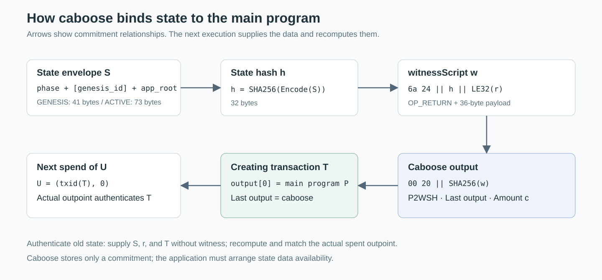
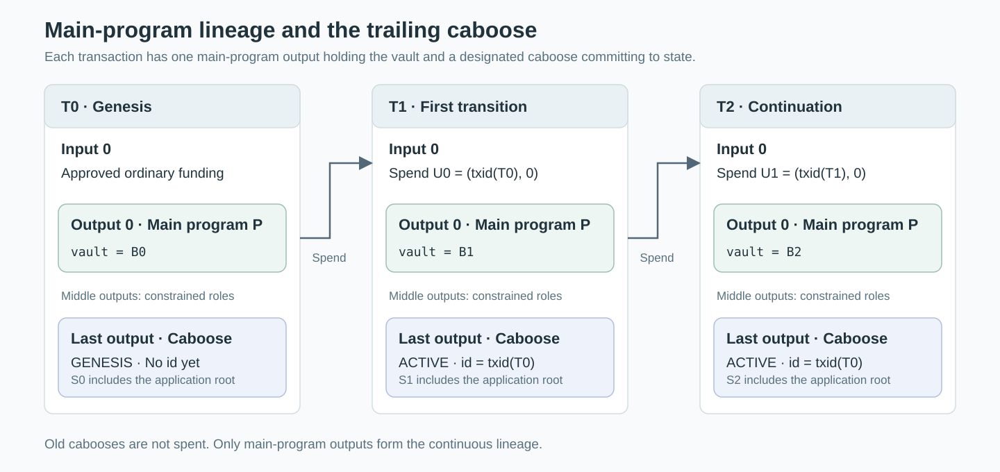
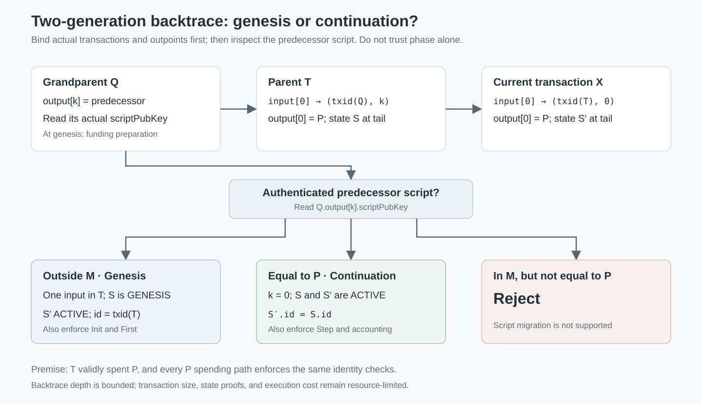

# UTXO Linearization: Chain Identity and State Continuity with Caboose

```text
BIP: ?
Layer: Applications
Title: UTXO Linearization with Caboose State
Authors: To be supplied by the proposer
Status: Draft
Type: Specification
Assigned: ?
License: To be specified by the rights holder
Version: 0.1.0
Requires: 141, 340, 341, 342, 347
```

**Research draft · 2026-09-08**

This document follows a BIP-style structure. It has not been assigned a BIP number or submitted as a formal BIP. The state encoding, validation algorithm, and implementation profile are proposed by this draft; a validated reference implementation of the complete protocol is not yet available. The proposer must complete the author and license fields before using this document for a formal submission.

Contents: [Abstract](#s1) · [Motivation](#s2) · [Scope](#s3) · [Terminology](#s4) · [Execution assumptions](#s5) · [State encoding](#s6) · [Caboose](#s7) · [Transaction structure](#s8) · [Introspection](#s9) · [Validation algorithm](#s10) · [Identity and uniqueness](#s11) · [Contract verification](#s12) · [Vault accounting](#s13) · [Resources and data](#s14) · [Rationale](#s15) · [Compatibility](#s16) · [Implementation status](#s17) · [Open research](#s18) · [Copyright](#s19) · [References](#s20).

<a id="s1"></a>
## 1. Abstract

This document defines a UTXO linearization protocol in which an application chain holds its vault funds in a unique main-program output and commits to its current state through a caboose output in the same transaction. Every state transition MUST spend the main-program output at input index 0 and create its unique successor at output index 0. All other inputs and outputs have explicitly constrained auxiliary roles and MUST NOT contain a second main-program instance.

The chain identifier is the txid of its genesis transaction. The genesis state commits to the initial application state but does not contain this identifier. The first transition obtains the genesis txid from the actual spent outpoint and writes it into the new state. Every subsequent transition preserves the identifier byte for byte.

Identity authentication combines CAT/Schnorr transaction introspection, parent-transaction txid reflection, and authentication of the predecessor output spent by the parent transaction. Provided that every main-program spending path enforces the same validation rules, two-generation backtracing and inductive enforcement can preserve identity without supplying the complete history for each spend.

<a id="s2"></a>
## 2. Motivation

Identical scripts do not identify the same program instance. Anyone can create a new output paying to an existing scriptPubKey, or copy another instance's claimed state and identifier. An observer who checks only the script or state fields cannot determine whether an output belongs to the intended chain.

This protocol names an instance by a specific creation event and binds all subsequent state transitions to that event. It provides three related properties: a stable instance identity, a unique valid main-program successor, and a transaction-level binding between the state commitment and the vault output.

The design targets a single-chain state machine: one main-program instance represents an application chain's current state and vault. It does not define composition that advances several independent main programs in one transaction.

<a id="s3"></a>
## 3. Scope and Normative Language

The terms MUST, MUST NOT, SHOULD, and MAY indicate requirement strength. Sections 4–10 and 12–14 define this draft's protocol requirements except where expressly identified as explanatory. Section 11 presents conditional arguments. Sections 15–20 and the accompanying implementation notes are informative.

This document specifies identity, the state envelope, transaction roles, and validation conditions. It does not define an application's consensus algorithm, block format, withdrawal authorization, proof system, or business-state transition function. An implementation MUST supply these extension points through a fixed application configuration. It MUST NOT replace application validation with an arbitrary Boolean supplied in the witness.

The stated properties apply within a valid view of the target chain. They do not provide naming across blockchains, cross-chain finality, automatic data availability, or a guarantee of continued execution.

<a id="s4"></a>
## 4. Terminology, Notation, and Application Configuration

| Symbol | Definition |
|---|---|
| `H(x)` | SHA256(x), producing 32 bytes |
| `H256(x)` | SHA256(SHA256(x)), producing 32 bytes |
| `T_n` | The transaction creating the nth main-program output; T0 is genesis |
| `U_n` | The outpoint `(txid(T_n), 0)` |
| `P` | This instance's complete P2TR scriptPubKey, unchanged throughout its lineage |
| `M` | A fixed, verifiable set of main-program scripts containing at least P |
| `B_n` | `T_n.output[0].value`: the actual vault amount in satoshis |
| `S_n` | The state envelope encoded under Section 6 |
| `A_n` | The application-state data, or the state described by an application proof |
| `app_root_n` | A 32-byte commitment to the application state |
| `C_n` | The last output of T_n: its designated caboose |
| `X, T, Q` | The current spending transaction, the parent that created its spent main-program output, and the grandparent referenced by T's input 0 |
| `EncodeTx(T)` | Bitcoin transaction serialization without witness, including scriptSig and nLockTime |
| `Spent(X,i)` | The output actually spent by input i of X, including its amount and scriptPubKey |

All transaction fields use Bitcoin consensus serialization. Fixed-width transaction integers and the randomizer r use little-endian encoding; CompactSize MUST use its shortest encoding. Schnorr public-key coordinates, challenge integers, and signature scalars instead follow BIP 340's big-endian representation. The txid used in an outpoint is the raw 32-byte result of `H256(EncodeTx(T))`. Conventional block-explorer txid strings display these bytes in reverse order. Implementations MUST NOT mix display order and outpoint order in state fields.

A deployment MUST fix an application configuration `D` specifying at least: the target-chain context; the complete Taproot construction; main-program recognition rules; the initial-state predicate `Init`; the first-transition predicate `First`; the ordinary transition predicate `Step`; state-commitment or proof rules; auxiliary input and output roles; the caboose amount `c`; vault-accounting rules; and application resource limits. These rules MUST be enforced by the main program or by validation logic it uses that is bound to the actual transaction.

The minimal configuration is `M = {P}`, which excludes all additional instances sharing this program script. An application that must exclude multiple kinds of main programs MUST define their script set or a verifiable recognition rule. The ability to infer the program semantics behind an arbitrary unknown P2TR output MUST NOT be assumed. External verifiers MUST know the expected P, application configuration, and chain context.

<a id="s5"></a>
## 5. Execution Assumptions

**ENV-1**: The target environment MUST execute opcode `0x7e` with the OP_CAT concatenation semantics described by BIP 347. Activation on the target chain MUST NOT be inferred solely from a BIP document's status. [BIP 347](https://github.com/bitcoin/bips/blob/master/bip-0347.mediawiki)

**ENV-2**: The main program uses Tapscript. Every available spending path MUST enforce the complete protocol validation. There MUST NOT be a script leaf that can rewrite identity, bypass authentication, or omit the successor. The Taproot internal public key MUST be constructed with no known discrete logarithm, preventing a known private key from bypassing the script through the key path. External verifiers MUST check the complete expected output construction, rather than accept a seemingly correct leaf in isolation.

**ENV-3**: The introspection mechanism MUST bind the data used by the script to the signature message of the actual `OP_CHECKSIGVERIFY` execution. Merely hashing a witness-supplied preimage does not satisfy this condition.

**ENV-4**: The protocol arguments assume standard hash-binding and elliptic-curve assumptions, correct consensus execution, and an authenticated transaction and chain context. A caller-supplied byte string with no authenticated spending relationship is not a “valid transaction” for these arguments.

<a id="s6"></a>
## 6. State Encoding

### 6.1 Canonical Envelope

This draft defines the following byte format. Constants denote exact bytes, not Script number encodings.

| Field | Bytes | Value or meaning |
|---|---:|---|
| `magic` | 7 | ASCII `UTXOLIN`: `55 54 58 4f 4c 49 4e` |
| `version` | 1 | `01` |
| `phase` | 1 | `00` for GENESIS; `01` for ACTIVE |
| `genesis_id` | 0 or 32 | Absent in GENESIS; mandatory in ACTIVE |
| `app_root` | 32 | Application-defined state commitment |

```text
EncodeGenesis(app_root) = magic || 0x01 || 0x00 || app_root
EncodeActive(id, app_root) = magic || 0x01 || 0x01 || id || app_root
state_hash = H(EncodeState(S))
```

The GENESIS encoding is exactly 41 bytes. The ACTIVE encoding is exactly 73 bytes.

**STATE-1**: Parsers MUST reject an incorrect magic value, an unknown version or phase, an incorrect total length, or any trailing bytes. GENESIS MUST NOT contain an id field.

**STATE-2**: The application MUST verify the relationship between `app_root` and the required application state or proof. Hashing the envelope establishes byte consistency; it does not replace application validation.

**STATE-3**: An all-zero id MUST NOT represent “no identity.” The phase and exact length determine whether an identity is present. Any 32-byte id in an ACTIVE envelope remains subject to the origin authentication in Section 10.

This encoding is introduced by this draft. It is not the existing wire format of the reference repository.

### 6.2 Identity Invariant

```text
S_0.phase = GENESIS
For every n >= 1:
    S_n.phase = ACTIVE
    S_n.genesis_id = txid(T_0)
```

The genesis state still contains the initial application-state commitment. Only the writing of genesis_id is deferred.

<a id="s7"></a>
## 7. Caboose State Commitment

For state S and an unsigned 32-bit randomizer r:

```text
h = H(EncodeState(S))
w = 0x6a || 0x24 || h || LE32(r)
caboose_spk = 0x00 || 0x20 || H(w)
```

The 38-byte witnessScript `w` means `OP_RETURN PUSHBYTES_36 <h || r>`. The 34-byte caboose_spk is the P2WSH script `OP_0 PUSHBYTES_32 H(w)`. [Reference construction](https://github.com/Bitcoin-Wildlife-Sanctuary/covenants-gadgets/blob/93e057f2abdac14760b6a8ff82ee4a613a263153/src/lib.rs#L265-L289)

**CAB-1**: Every protocol transaction MUST place its unique designated caboose at the last output. Its amount MUST equal c, fixed by the application configuration, and its scriptPubKey MUST equal the result above.

**CAB-2**: The main program MUST NOT use the caboose as a vault-funds output. The old caboose is not a transition input. Its witnessScript begins with OP_RETURN and is unspendable under the hash-security assumptions. [P2WSH rules](https://github.com/bitcoin/bips/blob/master/bip-0141.mediawiki)

**CAB-3**: The randomizer r changes the transaction commitment to support Schnorr grinding; it is not application state. Changing r still requires the transaction commitments to be satisfied. Different values of r MAY correspond to the same logical state.

**CAB-4**: No other output may use exactly the same scriptPubKey as this transaction's designated caboose. Other P2WSH outputs that might hide similar semantics are governed only by application-role rules and do not participate in main-program state authentication.



Figure 1. The state data passes through two hash commitments into the caboose. The creating transaction's txid then binds it to the main-program output. The state data does not appear directly in the caboose scriptPubKey.

<a id="s8"></a>
## 8. Transaction Structure and Role Partitioning

### 8.1 Transaction Format

Protocol transactions T_n in this draft's baseline use `nVersion = 2` and `nLockTime = 0`. Every input has `nSequence = 0xfffffffd` and an empty scriptSig. The outputs actually spent by the inputs MUST be application-approved native P2WPKH, P2WSH, or P2TR outputs, so that the empty-scriptSig model agrees with the actual consensus rules.

**TX-1**: There MUST be at least two outputs. Output 0 is the main program; the last output is the caboose. Every remaining output MUST satisfy the auxiliary-output rules. The baseline supports only the native SegWit output types listed above.

**TX-2**: Every protocol transaction and every ancestor used for txid reflection MUST satisfy the resource baseline in Section 14. The current transaction's format and size MUST be constrained when creating the successor; discovering only at the successor's spend that its parent cannot be reflected is too late.

### 8.2 Genesis Transaction

**GEN-1**: T0 MUST have exactly one input. The scriptPubKey of the output it actually spends MUST be outside M and MUST satisfy the application's permitted-funding-source predicate.

**GEN-2**: The set of output indices in T0 whose scripts belong to M MUST be exactly `{0}`, and output 0 MUST use P. Its caboose MUST commit to a GENESIS state that passes Init.

Creating the genesis output does not execute its new script. GEN-1 and GEN-2 are enforced by script when the main program is first spent. An observer accepting genesis before that spend MUST verify these conditions independently.

### 8.3 Transition Transaction

Define the complete index sets `I(X) = {0, …, len(X.input)-1}` and `O(X) = {0, …, len(X.output)-1}`:

```text
MainInputs(X)  = { i ∈ I(X) : Spent(X,i).scriptPubKey ∈ M }
MainOutputs(X) = { j ∈ O(X) : X.output[j].scriptPubKey ∈ M }
```

**LIN-1**: Every transition transaction X MUST satisfy `MainInputs(X) = {0}` and `MainOutputs(X) = {0}`. Both corresponding scriptPubKeys MUST equal P.

**LIN-2**: The input executing this validator MUST have index 0, and `X.input[0].prevout.vout` MUST equal 0. The current input index and the spent output index MUST be checked separately.

**LIN-3**: The baseline does not allow termination, branching, merging, or replacing P with another main-program script. Every valid spend MUST produce one successor. The system does not guarantee that anyone will spend that successor in the future.

### 8.4 Exhaustive, Disjoint Roles

**ROLE-1**: Input indices MUST be partitioned exhaustively into the main-program role and application-defined auxiliary input roles. Output indices MUST be partitioned exhaustively into main-program, caboose, and application-defined auxiliary output roles. Within each direction, the union of all role sets MUST equal the full index set, and every pair of distinct role sets MUST have an empty intersection.

**ROLE-2**: Role assignment MUST use authenticated fields and application rules. Implementations MUST NOT check only a caller-selected subset of inputs or outputs, and MUST NOT accept unrecognized entries by default.

**ROLE-3**: An auxiliary contract MAY participate in an application-approved interaction role, but MUST NOT be a second main program in M. Excluding simultaneous main-program transitions does not exclude all auxiliary script inputs.



Figure 2. Solid arrows represent spends of main-program outputs. Old cabooses remain in their creating transactions and are not consumed along the main-program chain. Each state and vault output are bound by the same creating transaction.

<a id="s9"></a>
## 9. Transaction Introspection and Commitment Authentication

### 9.1 Fixed Signature Configuration

**INT-1**: The signature used for main-program introspection MUST use `SIGHASH_ALL = 0x01`. It MUST NOT use ANYONECANPAY, NONE, or SINGLE. Set `ext_flag = 1`, omit the annex, and use `key_version = 0`. No OP_CODESEPARATOR may execute before the introspection signature check, so `codesep_pos = 0xffffffff`.

**INT-2**: The actual signature message MUST authenticate all input outpoints, amounts, spent-output scriptPubKeys, and sequences, together with all outputs. The corresponding fields are `sha_prevouts`, `sha_amounts`, `sha_scriptpubkeys`, `sha_sequences`, and `sha_outputs`. Every vector MUST be reconstructed in full, in order, using canonical serialization. The first four vectors MUST correspond to the same input count. [BIP 341](https://github.com/bitcoin/bips/blob/master/bip-0341.mediawiki#common-signature-message)

**INT-3**: The actual input index 0, tapleaf_hash, and Tapscript extension MUST be bound. The `tapleaf_hash` commits to the executed script; the scriptPubKey is authenticated through the spent-output commitment. These MUST NOT be conflated as `scriptCode`. [BIP 342](https://github.com/bitcoin/bips/blob/master/bip-0342.mediawiki#common-signature-message-extension)

The commitments use SHA256 subhashes. A hash is not an interface for reading its fields: the witness provides structured data, and the script reconstructs and verifies the commitment. `sha_sequences` does not commit to outputs.

### 9.2 CAT/Schnorr Construction Requirements

The reference repository's G/G Schnorr trick MAY implement INT-1 through INT-3, but its `0x81` configuration is not adopted here. In this construction, both the BIP340 public key and R are G. Interpret the raw challenge hash as a big-endian integer e. Vary r until the challenge hash ends in `0x01`, construct `s = e + 1`, and verify the signature `bytes32_be(x(G)) || bytes32_be(s) || 0x01`. The first two components are respectively a 32-byte big-endian coordinate and scalar. [Reference signature construction](https://github.com/Bitcoin-Wildlife-Sanctuary/covenants-gadgets/blob/93e057f2abdac14760b6a8ff82ee4a613a263153/src/bitcoin_script.rs#L241-L271)

**INT-4**: This specific construction MUST require the raw challenge integer to satisfy `e < n-1`, where n is the secp256k1 group order, to avoid an out-of-range scalar in this simplified increment. The challenge bytes, signature bytes, and actual signature message used by the script MUST agree. Unbound challenge hints MUST NOT be accepted. If the randomizer search is exhausted, the transaction constructor MUST report failure rather than bypass the condition. [BIP 340](https://github.com/bitcoin/bips/blob/master/bip-0340.mediawiki)

G has private key 1. It serves the introspection construction, not the unknown-discrete-log internal-point requirement in ENV-2.

### 9.3 Logical Witness Contents

**WIT-1**: At minimum, the witness MUST enable the validator to obtain and authenticate: the complete field vectors of X described above; the non-witness fields of T and Q; the old and new state envelopes and their respective randomizers; application-state openings or proofs and action authorization; and any required introspection-construction hints.

**WIT-2**: An implementation MAY omit constant fields from its witness under a fixed template, but MUST insert their exact values during script reconstruction. Every dynamic field MUST be bound through the corresponding hash and consensus message.

This document specifies what the witness must establish, not the stack-item order of every application Taproot leaf. Deployments MUST publish their stack layout and serialization scheme. Witnesses for different applications need not be interchangeable.

<a id="s10"></a>
## 10. Genesis and Continuation Validation Algorithm

### 10.1 Common Authentication

Let X be the transaction whose main-program spend is being validated. Its input 0 spends output 0 of parent T. Let `T.input[0].prevout = (q, k)`, and let Q be the transaction with txid q.

**AUTH-1**: Authenticate X's complete inputs, outputs, and signature context, and enforce the TX, LIN, ROLE, and INT rules.

**AUTH-2**: Reconstruct T and require `H256(EncodeTx(T)) = X.input[0].prevout.txid`. The script and amount of T.output[0] MUST equal the actual `Spent(X,0)`. Validate T's protocol transaction format, complete output layout, and designated caboose commitment to the old state S.

**AUTH-3**: Reconstruct Q, require `H256(EncodeTx(Q)) = q` and `k < len(Q.output)`, and read `Q.output[k]`. T's input serialization contains the outpoint, not the script of the spent output. Q supplies the authenticated source of that script.

**AUTH-4**: Select the branch using the authenticated `Q.output[k].scriptPubKey`. Input count, the old state's phase, or a caller assertion alone MUST NOT determine the branch.

**AUTH-5**: Verify that X's designated caboose commits to the new state S′, and enforce the accounting rules in Section 13 together with application-state and authorization validation.

### 10.2 Genesis Branch

When `Q.output[k].scriptPubKey ∉ M`:

**INIT-1**: T MUST satisfy GEN-1 and GEN-2. Q.output[k] MUST satisfy the permitted-funding-source predicate.

**INIT-2**: S MUST be GENESIS. The initial application state, initial vault, and creation context MUST pass `Init(D, T, Q.output[k], S, proof)`.

**INIT-3**: S′ MUST be ACTIVE, and `S′.genesis_id` MUST equal `H256(EncodeTx(T))`.

**INIT-4**: The first application transition MUST pass `First(D, S, S′, X, action, proof)`.

Here T is T0 and X is T1. The “genesis branch” executes when T0's output is first spent; it does not imply execution of the new output script when T0 was created.

### 10.3 Continuation Branch

When `Q.output[k].scriptPubKey = P`:

**NEXT-1**: Require k = 0. T's input 0 therefore actually spends output 0 of the preceding P instance.

**NEXT-2**: S and S′ MUST both be ACTIVE, and their 32-byte genesis_id fields MUST be identical byte for byte.

**NEXT-3**: The application transition MUST pass `Step(D, S, S′, X, action, proof)`.

This branch depends on T being an actual valid ancestor and on every available spending path of P enforcing this protocol. T's actual spend already performed the previous round of identity authentication. Checking only a similar-looking leaf MUST NOT substitute for that premise.

### 10.4 Rejection

**REJECT-1**: If the predecessor script belongs to `M \ {P}`, or if any requirement above fails, the main-program spend MUST fail. Migration between main-program scripts is outside this version.

### 10.5 Normative Pseudocode

The following function calls denote authenticated checks, not permission to trust identically named witness fields. `RequireOutputLayout(T,D)` verifies the parent's structural output requirements, including unique P, the designated trailing caboose, and the auxiliary region. The continuation branch does not require all of T's historical application-authorization proofs to be supplied again; it relies on T's actual valid spend.

```text
ValidateSpend(X, witness, D):
    cur = AuthenticateAllCommittedFields(X, witness, SIGHASH_ALL)
    RequireExecutionContext(cur, index=0, annex=false)
    RequireProtocolFormatAndResourceBounds(X)
    RequireCompleteRolePartition(X, cur.spent_outputs, D)
    Require(cur.spent_outputs[0].script == P)
    Require(X.input[0].prevout.vout == 0)

    T = AuthenticateTransaction(witness.parent,
                                X.input[0].prevout.txid)
    RequireProtocolFormatAndResourceBounds(T)
    Require(T.output[0] == cur.spent_outputs[0])
    RequireOutputLayout(T, D)
    S = AuthenticateCaboose(T.last_output, witness.old_state,
                           witness.old_randomizer, D.c)

    (q, k) = T.input[0].prevout
    Q = AuthenticateTransaction(witness.grandparent, q)
    RequireReflectionResourceBounds(Q)
    Require(k < Q.output_count)
    predecessor = Q.output[k]

    Snew = AuthenticateCaboose(X.last_output, witness.new_state,
                              witness.new_randomizer, D.c)

    if predecessor.script not in M:
        Require(T.input_count == 1)
        RequireAllowedGenesisFunding(predecessor, D)
        Require(S.phase == GENESIS)
        Require(Init(D, T, predecessor, S, witness.app_proof))
        Require(Snew.phase == ACTIVE)
        Require(Snew.id == H256(EncodeTx(T)))
        Require(First(D, S, Snew, X, witness.action, witness.app_proof))
    else if predecessor.script == P:
        Require(k == 0)
        Require(S.phase == ACTIVE and Snew.phase == ACTIVE)
        Require(Snew.id == S.id)
        Require(Step(D, S, Snew, X, witness.action, witness.app_proof))
    else:
        Reject()

    RequireVaultAccounting(X, cur.spent_outputs, S, Snew, D)
    Accept()
```



Figure 3. Q authenticates the actual predecessor script for T's input 0. The continuation branch relies on the consensus validity of T's spend of P. It does not require another opening of Q's application state or the complete earlier history.

<a id="s11"></a>
## 11. Identity, Unique Succession, and Conditional Arguments

### 11.1 Meaning of Authenticated Identity

An output with P and a well-formed caboose is merely a *candidate output*. A candidate that satisfies the genesis conditions is a genesis candidate. An ACTIVE output produced by a valid protocol transition belongs to an authenticated lineage. External acceptors MUST NOT equate “parsable” with “authenticated origin.”

Authenticating the intended chain also requires comparison against a known `expected_genesis_id`. An attacker creating a new instance with a different valid id has not forged an identity. Accepting any id instead of the expected one is a caller authentication-policy error.

### 11.2 Inductive Argument

**Base case.** Ordinary funds create an arbitrary `P + ACTIVE(copied_id)` output. At its first spend, Q authenticates its actual non-main-program origin. The genesis branch applies, but INIT-2 requires GENESIS, so the spend fails. If the attacker instead creates a valid GENESIS state, INIT-3 assigns the new creation transaction's own txid.

**Inductive step.** If parent T spends P, ENV-2 requires it to satisfy the same protocol checks. T can only establish the first active identity or preserve the previous identity unchanged. Once the current execution authenticates that actual spending relationship through Q, it can inherit this conclusion.

This argument depends on a correct complete implementation and the stated cryptographic assumptions. It does not replace reference scripts, adversarial tests, or a formal proof. In particular, implementations must establish that an arbitrarily created counterfeit P output cannot become a valid entry point into the inductive lineage.

### 11.3 Single Lineage

Every valid genesis creates one main-program output; every valid transition produces one successor. Within a fixed valid chain view, an actual outpoint cannot be validly spent twice. Consequently, each authenticated identity has at most one current unspent main-program output.

Under these constraints, the main-program output index is always 0, so the identifier need not repeat vout. This uniqueness belongs to this protocol and the selected chain context. It does not mean that any arbitrary transaction txid inherently identifies only one arbitrary program.

A single lineage does not exclude reorganizations, conflicting candidate transactions, or halted progress. Following a reorganization, observers must roll back their state index to match the target chain view.

### 11.4 Verification Depth

Each spend supplies T and Q, so historical backtrace depth does not grow with program lifetime. Byte size and execution cost still depend on transaction size, application proofs, script paths, and the resource profile. The construction MUST NOT be described as having unconditional constant cost.

<a id="s12"></a>
## 12. Verification by Observers and Auxiliary Contracts

### 12.1 Observers

**VERIFY-1**: An observer MUST establish the target-chain context, expected P, and expected genesis_id, and authenticate the actual transactions and their validity used in its reasoning. A full node may use its validated ledger. An observer holding only raw transaction bytes does not satisfy this requirement.

For an initial output, the observer checks T0, its funding predecessor Q, the genesis format, and the initial state. For an ACTIVE output, the observer may authenticate that its creating transaction actually spent the expected P and use protocol induction under ENV-2 and a validated transaction context. If these premises have not been established, it should backtrace explicitly or use another defined proof mechanism.

**VERIFY-2**: Recognizing the *current* state also requires verifying that the main-program output is unspent in the selected chain view. A block-inclusion proof alone does not establish unspentness.

### 12.2 Auxiliary Contracts in the Same Transaction

**VERIFY-3**: An auxiliary contract at index j > 0 MUST independently authenticate the actual transaction fields it uses, confirm that input 0 spends the expected P, and compare the expected genesis_id. It MUST NOT assume that another script's success makes arbitrary witness fields trustworthy.

The auxiliary contract can authenticate parent T and the old caboose, or authenticate the new caboose through the complete output commitment. All inputs must succeed for the transaction to be valid. The main-program spend therefore executes Section 10's identity checks without requiring a separate “script call succeeded” opcode.

**VERIFY-4**: The auxiliary contract MUST specify whether the interaction refers to the state before or after the transition. The old state in the first transition has no id. To authenticate the new identity in that case, the contract MUST check that the new state's id equals the genesis txid referenced by input 0, together with the remaining interaction conditions.

This mechanism permits auxiliary contracts to participate in a single-main-program transition. It does not permit two independent main programs that both require index 0 to advance together. A complete cross-chain messaging protocol is outside this specification.

### 12.3 Historical Queries Without a Joint Spend

**VERIFY-5**: Without an actual joint-spending relationship, historical transactions and state openings MUST be bound to an independently authenticated historical anchor or chain proof. Recomputing a txid alone proves neither that the transaction exists in the target chain nor that it represents the latest state.

<a id="s13"></a>
## 13. Vault Amounts and Authorization

**VALUE-1**: The old vault amount MUST come from `Spent(X,0).value`; the new amount MUST come from `X.output[0].value`. If application state tracks balances, assets and liabilities, or withdrawal limits, their relationship to the actual amounts MUST be verified.

**VALUE-2**: The application MUST explicitly authorize every deposit, expenditure, and cost borne by the vault. One permitted accounting form is:

```text
B_new = B_old + authorized_deposits
                 - authorized_withdrawals
                 - allowed_vault_costs
```

Every term MUST correspond to authenticated actual inputs, outputs, or an explicit fee allocation. The miner fee equals total input amounts minus total output amounts; it cannot be inferred solely from the change in the main-program balance.

**VALUE-3**: The configuration MUST specify who pays the miner fee, caboose amount c, and other costs. Calculations MUST use exact integers and check ranges and overflow. Identity and linear continuity alone do not prevent vault funds from being converted into miner fees.

<a id="s14"></a>
## 14. Resource Profile and State Data

### 14.1 R1 Reflection Profile

The R1 profile gives this draft's direct CAT-reflection construction explicit resource bounds:

**RES-1**: The non-witness serialization of every protocol transaction MUST NOT exceed 520 bytes. Each reflected T and Q MUST also fit within 520 bytes. Every intermediate CAT result, hash-input stack element, and initial witness stack element MUST independently satisfy the target environment's limits.

**RES-2**: Every input scriptSig in Q MUST be empty, matching this profile's reflection input model. All remaining fields MUST be reconstructed completely and canonically. In the continuation case, Q is itself a protocol transaction. In the first-transition case, the funding-preparation transaction Q MUST also satisfy this restriction. Funding parties may need to construct a suitable preparation transaction first.

**RES-3**: Output-script lengths, field lengths, complete vector counts, and parsing boundaries MUST be verified. Implementations MUST NOT rely on a caller-asserted transaction length or split oversized data into chunks and claim that this produces the same SHA256 result. Any separately implemented streaming hash requires its own correctness argument and a distinct resource profile.

The 520-byte limit applies to an individual stack element, not the entire transaction including witness. Tapscript also imposes stack-count and signature-operation-budget constraints, which application scripts and proofs must satisfy. [BIP 342 resource limits](https://github.com/bitcoin/bips/blob/master/bip-0342.mediawiki#resource-limits), [BIP 347](https://github.com/bitcoin/bips/blob/master/bip-0347.mediawiki#specification)

R1 is a deliberately conservative baseline, not a claim that OP_CAT cannot support other designed resource schemes. An extension of R1 MUST preserve all identity and role constraints in this protocol.

### 14.2 State Data Availability

**DATA-1**: Deployments MUST define how application-state data, proof material, state envelopes, and randomizers are retained or published so that a successor witness can be constructed. A caboose commits to hashes; it does not automatically publish the underlying state data.

State data can come from untrusted sources and be checked against commitments. This does not guarantee that the data will remain recoverable. Missing data can prevent an otherwise valid main program from advancing.

<a id="s15"></a>
## 15. Rationale

**Using txid as identity.** A fixed main-program output index and one main-program instance per valid creating transaction make its txid sufficient to name the instance. No external identity registrar is needed, although callers still need to know their expected id.

**Writing the id at the first transition.** Including T0's txid in T0's own output commitment would introduce self-reference. Deferring the write to T1 avoids that dependency. The reason is not that a SegWit transaction must be signed before its txid can be calculated: witness is excluded from txid serialization.

**Caboose and a fixed P.** The fixed P carries execution rules and the vault, while the P2WSH caboose commits to changing state. Its hash can be reconstructed in Script without recomputing a Taproot output point for every state update.

**The last output.** Keeping the caboose at the end fixes the main program at output 0 and leaves a clearly defined intermediate region for withdrawals, change, and other roles. With exactly two outputs, this matches the reference repository's layout.

**Complete input commitments.** Omitting ANYONECANPAY allows all input scripts, amounts, and positions to be authenticated, supports exclusion checks over the input set, and provides a common basis for fees and auxiliary-contract verification.

**Two generations rather than one.** Parent T's inputs do not contain the scriptPubKeys of the outputs they spend. Grandparent Q authenticates the relevant predecessor script; the protocol then reasons inductively from the rules already enforced by the same P. Omitting Q and simply trusting a claim that the parent's input was also the program removes a necessary binding.

**An application root rather than an arbitrarily large envelope.** A fixed 32-byte app_root makes the identity layer's encoding and resource use predictable. Application-state size and proof format remain application-defined.

<a id="s16"></a>
## 16. Backward Compatibility and Deployment

This protocol uses existing outpoints, P2TR, P2WSH, and transaction serialization. It allocates no new address version or transaction field. Execution requires the specified OP_CAT semantics in the target environment; this document does not define an OP_CAT activation process.

Existing `covenants-gadgets` commitments provide a caboose construction reference, but its state encoding, `0x81` signature mode, limited transaction templates, and initialization handling do not establish compliance with this draft. Existing outputs cannot acquire these rules through a client-only update. Deployment requires corresponding new main-program scripts and instances.

This version does not support script upgrades, termination, or migration that preserve the original id. Such extensions require separate definitions and a renewed review of the inductive argument and external verification policy.

<a id="s17"></a>
## 17. Reference Components, Examples, and Validation Status

The reference components are pinned to [`covenants-gadgets` commit `93e057f2abdac14760b6a8ff82ee4a613a263153`](https://github.com/Bitcoin-Wildlife-Sanctuary/covenants-gadgets/tree/93e057f2abdac14760b6a8ff82ee4a613a263153). The caboose construction, CAT/Schnorr trick, signature-message gadgets, and transaction-serialization gadgets were inspected. Its 18 existing library tests passed, including simulated counter transitions. The initialization test inserts an initial transaction directly; it does not implement this document's genesis authentication.

Accompanying files:

- [Implementation mapping and research tasks](implementation-notes.md): differences between existing code and this specification.
- [Verification-case matrix](verification-cases.md): acceptance and rejection scenarios for implementers.
- [Encoding vectors](vectors/encoding-vectors.json): deterministic state-envelope and caboose examples.
- [Vector verifier](vectors/verify_vectors.py): a Python-standard-library checker for bytes and hashes, not a Bitcoin Script validator.

Complete identity-validation scripts, end-to-end transaction examples, script-size and cost measurements, and the new adversarial tests remain unimplemented. Neither the existing repository tests nor this package's encoding vectors establish that the new protocol has been securely implemented.

<a id="s18"></a>
## 18. Open Research

1. Implement AUTH-1 through AUTH-5 in an actual OP_CAT execution environment and verify the entry conditions of the two-generation induction.
2. Provide complete witness stack layouts, scalar-bound checks, and measured script resource usage.
3. Instantiate M, Init, First, Step, auxiliary roles, and vault-fee policies for a concrete application. These are configuration extension points, not placeholders that may simply accept.
4. Validate auxiliary-contract authentication and authorization for states before and after a transition.
5. Evaluate R1's limits on funding preparation, withdrawal counts, and application proofs. Any extension needs a separate serialization or hashing design and tests.
6. Specify state publication, recovery, and reorganization handling. Historical queries, if needed, require a separate proof protocol with authenticated anchors.

<a id="s19"></a>
## 19. Copyright and Attribution

Attribution, the formal publication date, and licensing of this document and its new figures are to be determined by the proposal's rights holder. Referencing the repository does not place this document under that repository's license or alter rights in cited materials. Before formal submission, the author and license information must meet the submission requirements. [BIP document structure](https://github.com/bitcoin/bips/blob/master/bip-0003.md#bip-format-and-structure)

<a id="s20"></a>
## 20. References and Version History

Underlying specifications: [BIP 141](https://github.com/bitcoin/bips/blob/master/bip-0141.mediawiki), [BIP 340](https://github.com/bitcoin/bips/blob/master/bip-0340.mediawiki), [BIP 341](https://github.com/bitcoin/bips/blob/master/bip-0341.mediawiki), [BIP 342](https://github.com/bitcoin/bips/blob/master/bip-0342.mediawiki), and [BIP 347](https://github.com/bitcoin/bips/blob/master/bip-0347.mediawiki). These documents define the underlying mechanisms; they do not endorse the protocol proposed here.

Implementation background: [pinned `covenants-gadgets` revision](https://github.com/Bitcoin-Wildlife-Sanctuary/covenants-gadgets/tree/93e057f2abdac14760b6a8ff82ee4a613a263153). The CAT20 analogy in the original concept note is not used as a security argument or normative dependency.

| Version | Date | Changes |
|---|---|---|
| 0.1.0 | 2026-09-08 | Initial research draft: one main program, fixed state encoding, trailing caboose, complete commitments, genesis and continuation branches, two-generation backtracing, and the R1 resource profile |
